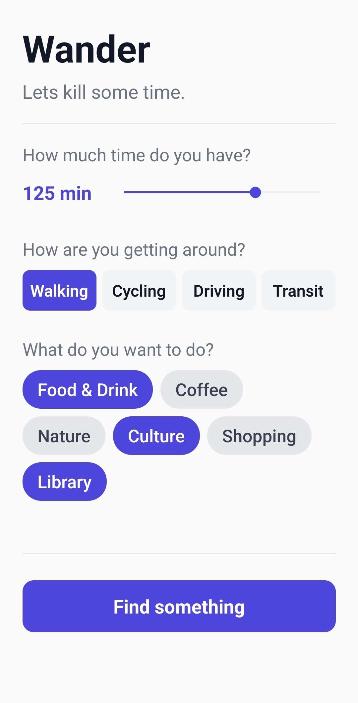
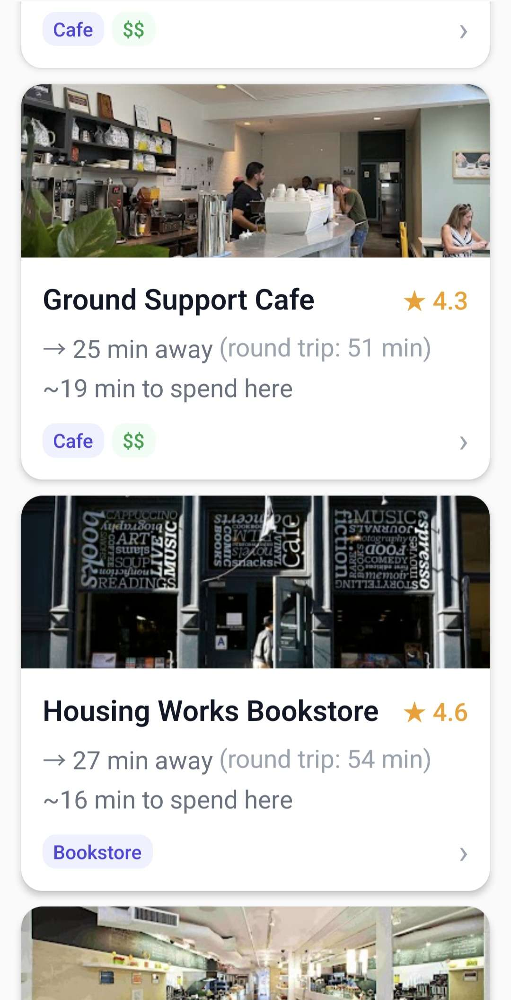
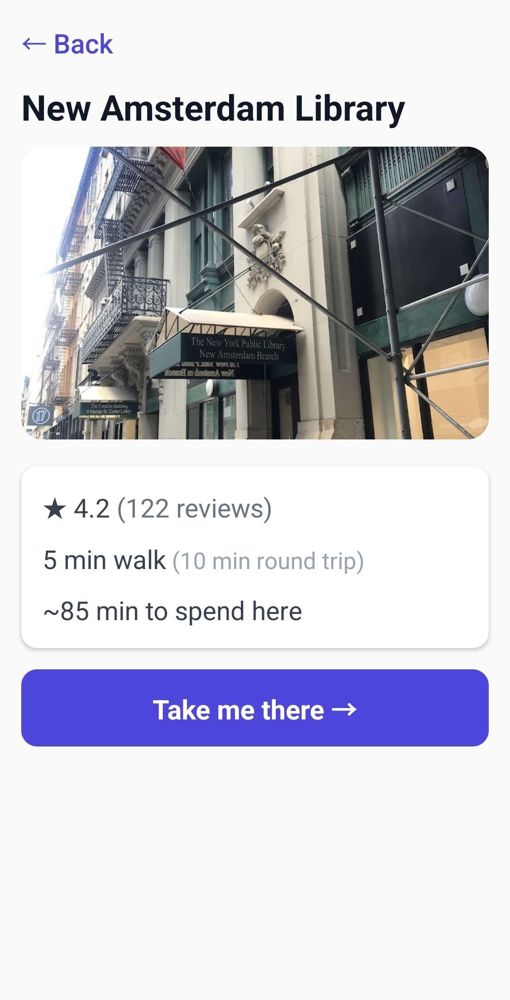

# Wander
**Lets kill some time**

Wander is a mobile app for free afternoons and those moments between plans. Tell it how much time you have and how you're getting around, and it'll find nearby places you can visit given your time budget, factoring in travel time there and back.

  
  
  

### How It Works
Wander shows you places where, after accounting for the round trip, you'd have meaningful time to actually spend there.

1. Set your time budget and your means of travel
2. Optionally, filter by category (food, nature, shopping, etc.)
3. Wander fetches nearby places, and calculates round-trip travel times for each, and filters out anything where you'd barely have time to look around
4. Results are ranked by a score that balances time available, popularity, and Google ratings
5. Tap any result for location details and navigation via Google Maps

### Technical Highlights
The ranking logic is the core of the app (`utils/ranking.ts`). For each candidate place returned by the Google Places API, the algorithm:
- Calculates round-trip travel time using the Google Distance Matrix API
- Filters out closed venues and places where `timeAtVenue <= 5 minutes`
- Scores remaining places using a weighted formula:

`score = (timeAtVenueMins * 0.5) + (rating * 3) + (log(totalRatings + 1) * 2)`

this formula is intended to reward places you'd have the most time at, while using logarithmic scaling on review counts so a place with many reviews doesn't dominate the algorithm solely off popularity.

### API Proxy Structure
Google API keys embedded in a mobile binary can be extracted from the APK. To prevent this, all Google API calls are routed through a thin Express backend on Render.
`Wander -> Express Backend (Render) -> Google APIs`

### Distance Matrix Chunking
Google's Distance Matrix API is limited to 25 per request. When multiple category filters are selected, the candidate pool can reach exceed this limit. In this case, the backend splits destinations into chunks of 25, fetches them in parallel, and merges the results.

---

### Tech Stack
 
**Mobile (React Native / Expo)**
| Technology | Role |
|---|---|
| Expo + React Native | Cross-platform mobile app (Android + iOS from one codebase) |
| TypeScript | Type safety across the entire frontend |
| Expo Router | File-based navigation (similar to Next.js) |
| Expo Location | Device GPS and permission handling |
| react-native-maps | Native Google Maps rendering |
| Zustand | Lightweight global state management |
| AsyncStorage | Persisting user preferences between sessions |
| Vitest | Unit testing for core logic |
 
### Backend (Node.js / Express)
| Technology | Role |
|---|---|
| Node.js + Express | Thin API proxy server |
| TypeScript | Type safety on the backend |
| Render | Cloud deployment |
 
**APIs**
| API | Role |
|---|---|
| Google Places Nearby Search | Finding points of interest near the user |
| Google Distance Matrix | Calculating real travel time to each candidate place |
| Google Maps SDK (Android/iOS) | Rendering the in-app map |

---

### License
MIT
